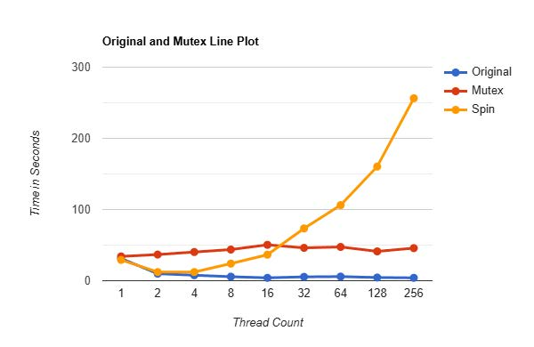

# xv6 functional extensions
<br>

This repository hosts a collection of projects implemented in the xv6 environment as a way to understand operating systems. All projects are results of group efforts with Ethan Bell with the exception of project 4 Tail.

## Parts

1. Scheduling
2. Parallelism with mutex
3. Strace
4. Tail


## 1. Scheduling

Operating systems (OS) scheduling involves a Process ID (PID), a nice number, and the scheduling algorithm.

#### PID

A PID is a unique integer assigned by the operating system kernel to each active process in order for the OS to track it internally, as well as for other programs to reference specific processes.

#### Nice value

The "nice" value is a numerical representation of a process's scheduling priority, specifically its "niceness" or willingness to let other processes have CPU time. A low nice value means the process is mean but has high scheduling priority. Default value tends to be set at 0.

#### Scheduling

The default scheduling algorithm in xv6 is round robin, which is to line each process up in a circular queue and take turn to occupy CPU time. While this is fair it does not do justice to processes that demand higher response times.

This calls for the implementation of a priority scheduling algorithm.

All new processes have a nice value 3, and all processes created by fork to inherit their parent’s nice value.

In ``proc.c`` and within the function ``void scheduler(void)``, we run a for loop that starts with ``int i = 1`` and goes up to ``i = 5``. For each iteration of this loop, we run a similar loop to the round robin scheduler. Within each run of this inner loop, we search through the process table looking for a runnable process that has a nice value less than or equal to ``i``. 

If one is found, we do everything done within round robin with the addition of setting ``i`` back to 1. If a process is not found, ``i`` is incremented and the process table is searched again. If ``i`` makes it to 5 and no process is found, the infinite loop within the scheduler will start the search again at ``i = 1``.

#### Testing

To verify results, run test with the following command
```
make scTest
```
This test case leaves the parent’s nice value at the default of 3. Two children are then created with nice values of 1. Each of them counts to 1 billion printing out each number divisible by 100 million along the way. Since xv6 uses two processors, each child will be taking up 1 processor at all times, leaving no free processors for the parent. After, but not before, one of the children finishes counting to 1 billion, we see the parent get allocated runtime again. This is consistent with a priority scheduler where a low priority process is never allocated runtime, while there exists runnable processes with higher priorities.


## 2. Parallelism with Mutex and Spinlock

#### Context
Begin by understanding the irregular output of ``parallel_hashtable.c``.

Unintended behaviors occur as a result of race conditions. Multiple threads have access to the table at the same time. In the code, the function void insert(int key, int val) is responsible for this behavior.

For instance, when thread 0 and thread 1 call ``insert(keys[key], tid)`` within
put_phase, each one is pulling a random number from the int array keys and passing it as the key parameter in the insert function. Within their respective calls to this function, it is possible that the line “i = key % NUM_BUCKETS” will assign the same value to i within both threads.For example, if i = 3 in both threads, they will both insert into table 3.

It can be the case that thread 0 has saved e->next = table[3], but timed out before it can run table[3] = e. Thread 1 starts running, sees the old value for table[3], and finishes running both e->next = table[3] and table[3] = e. When thread 0 runs again, it will overwrite the bucket_entry that thread 1 stored at table[3].

Consequently, when function bucket_entry * retrieve(int key) advances down the linked list with b = b-> next, it won’t find the key value for the random number that thread 1 attempted to insert into the linked list table[3], , which is counted as lost in void * get_phase(void *arg). As a side note, since the keys are random numbers, it is possible that a different thread will call the insert function and use the same random number that thread 1 used for the key value. In this case, the key wouldn’t be counted as lost, but this is still undesirable behavior.

The implementations of mutex and spinlock are an attempt to avoid race conditions.


#### Mutex

``parallel_mutex.c``

Mutex places any threads attempting to access the lock into the blocked state. Once the thread holding the lock calls unlock, one of the threads waiting for that lock will be moved to the ready state. This allows the CPU to do more work, as threads awaiting a lock aren’t given runtime until the lock is available.

#### Spinlock

``parallel_spin.c``

With a spinlock, on the other hand, the thread attempting to acquire a lock that is
held by a different thread will enter an endless loop where it will “busy wait” until the lock is released or the scheduled places it in the ready state. Consequently, while this thread waits for the lock to become available, it will release the rest of its time quantum and any other time quanta that the scheduler allocates it.

#### Comparison

We expected and observed a significant increase in runtime when we replaced all mutex locks with spinlocks. The difference between the two that causes this increased runtime is the way the two react when they attempt to lock a resource that is already locked explained above.



<br>

## 3. Strace

Linux provides developers a powerful tool called “strace” with the ability to show system calls or library calls, which a program made at a low level. It is often used to narrow down the scope of failure when debugging by displaying the system calls before program crashes. It helps in detecting the issues without needing the details of source code.

For this project, the following commands have been implemented:

<br>

```
strace on
```
Turns on ``strace`` and the next typed in command will be traced. The system call list will be printed on screen in format ``pid command_name system_call_name return_value``.

<br>

```
strace off
```
Turns off ``strace`` and the next typed in command won’t be traced and nothing is printed on the screen besides the routine results.

<br>

```
strace run
```
Instead of turning on and off strace, this command directly starts tracing the current process that executes a command. For example: when typing ``strace run echo hello`` in the terminal, we get the output tracing of ``echo hello``.

<br>

```
strace dump
```
Kernel memory saves N number of latest events to print to screen. This N number is configurable with #define to declare a variable called N with a certain value.

<br>

```
strace -e <system call name>
```
When option flag ``-e`` is provided followed by a system call name (ex: write), print only that system call. If no such system call is made in the command, print nothing.

<br>

```
strace -s <system call name>
```
When option flag ``-s`` is provided, print only successful system calls.

<br>

```
strace -f <system call name>
```
When option flag ``-f`` is provided, print only failed system calls.

<br>

```
strace -o <system call name>
```

When option flag ``-o`` is provided, write strace output to file.

<br>

## 4. Tail

The traditional UNIX tail utility can print out lines from the end of a file. If the number of lines is not given, then tail would print out the **default** number of lines, which are the last 10 lines of its input. 
```
tail <FILE>
```

The number of lines to be printed can be specified by calling
```
tail -NUM FILE
```
For example,
```
tail -2 README
```
prints the last 2 lines of the file README.

A tail program is written for xv6. If a filename is provided on the command line, then tail should open it, read and print the last NUM lines (no extra blank lines), and then close it. If no filename is provided, tail should read from standard input.

Source file :
```
tail.c
```